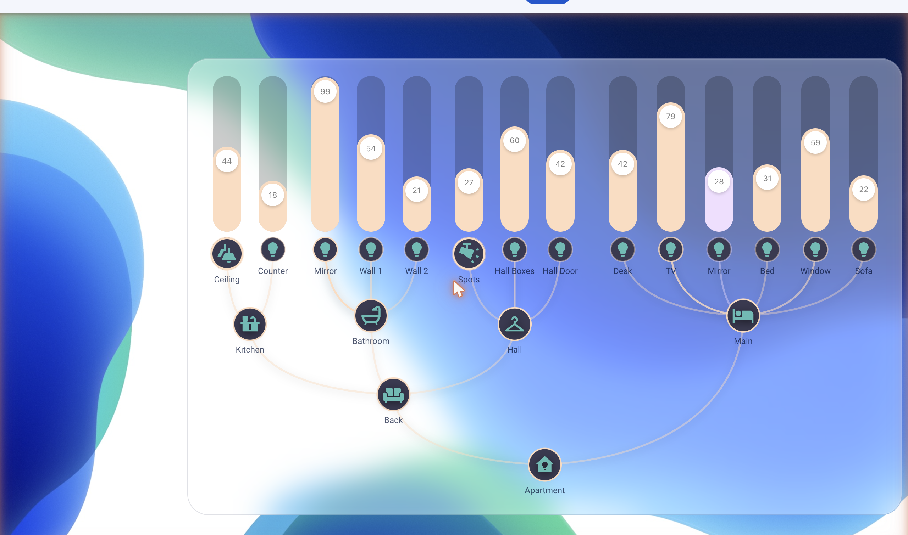
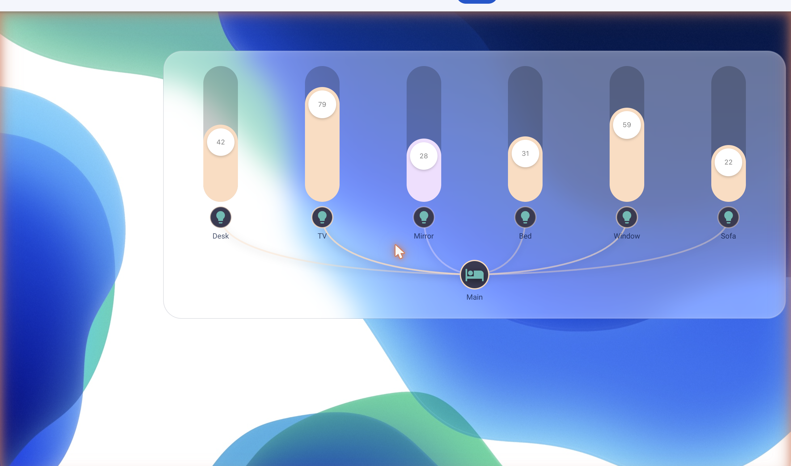
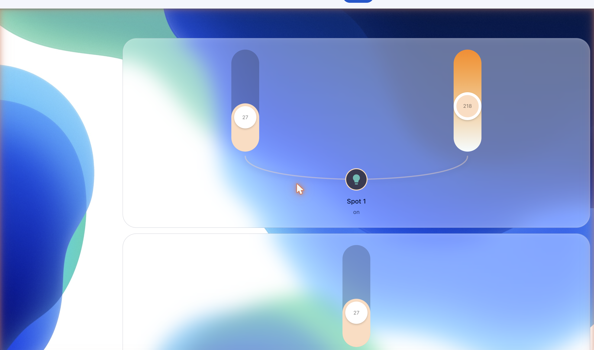
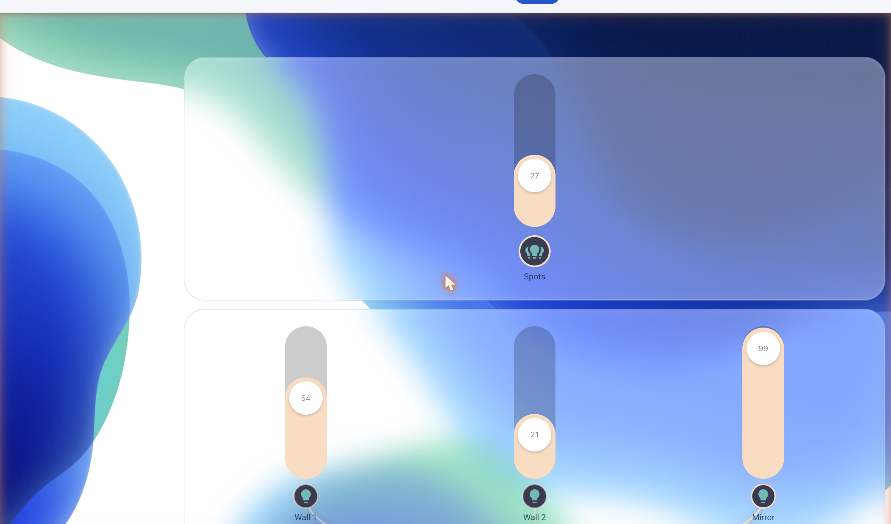

# Everyday Light Card

> A group-aware Lovelace card for Home Assistant — turn 14 lights into one card with a mindmap topology, in-place color wheel, and saved-colors that persist across reloads.

[](https://github.com/f17mkx/everyday-light-card/releases)
[](LICENSE)
[](https://www.home-assistant.io/)
[](https://github.com/sponsors/f17mkx)
[](https://www.buymeacoffee.com/f17mkx)



## Why this exists

Home Assistant's stock light card gives you one light at a time. Mushroom gives you a tile, not a topology. Bubble Card is gorgeous but doesn't model groups. You end up with rows of identical tiles that don't tell you anything about how your apartment is structured.

This card models the actual relationship between lights — six bedroom lights live under a "Main" group, that group lives under your apartment root, and the visual layout shows it. Tap the apartment to toggle everything. Tap a group to toggle just that group with full state-restore (the snapshot pattern, not just on/off). Long-press any light's icon to swap into color mode, color-temp mode, hue, saturation, or a saved-colors palette — without leaving the card.

## Features

- **Mindmap topology** — group icons connect to members via state-reactive SVG bézier curves. Color follows entity state, opacity follows brightness.
- **In-place mode picker** — long-press a member's icon, drag to one of 4 modes (brightness · temp · color wheel · saved palette). No popup leave, no settings dialog.
- **Group toggle with state-restore** — tap the group icon, all members go off but their last state is snapshotted as a scene. Tap again, exact restore.
- **Color wheel** — stepped (12 hues × 4 saturation rings, default) or smooth gradient. Click any sector, light snaps to that hue+sat.
- **Saved-colors palette** — 8-cell grid you build by long-press → save current. Persists in HA's native user-data store (zero-config) or your own `input_text` helper.
- **Effects-list picker** — for gradient strips and effect-supporting lights, scrollable list with reorder + delete + restore.
- **Parallel-axis view** — turn one light into 4 stacked sliders (brightness · temp · hue · sat) for a single "make-it-cozy" tile.
- **Compact-or-expanded** — `group.layout: compact` shows one consolidated slider + group tile. Long-press the tile, the group expands inline.
- **Speaker row** — media_player domain renders a horizontal mixer-fader with ± buttons and play/pause (Bubble-Card-inspired layout).
- **Runtime gesture rebinding** — map any tap / long-press / press-drag to any mode via config (`gestures.member_icon`, `gestures.group_icon`).
- **Theme-friendly** — consumes HA token vars (`--paper-item-icon-active-color`, `--state-light-active-color`, `--card-background-color`). Custom theme overrides via `--everyday-*` CSS variables.

### A group, expanded



### One light, parallel-axis



### Compact and expanded, side by side



## Install (via HACS)

The card is in HACS-Default.

1. Open HACS → Frontend → Custom repositories (⋮ menu) → add `https://github.com/f17mkx/everyday-light-card` as type `Lovelace`. Skip this if the card is already listed.
2. Search "Everyday Light Card" → install.
3. Hard-refresh (Cmd/Ctrl+Shift+R).
4. Add the card to a dashboard.

## Install (manual)

1. Download `everyday-light-card.js` from the [latest release](https://github.com/f17mkx/everyday-light-card/releases/latest).
2. Copy to `<config>/www/everyday-light-card.js`.
3. Settings → Dashboards → Resources → Add: URL `/local/everyday-light-card.js`, type `JavaScript module`.
4. Hard-refresh. Add the card in dashboard edit-mode.

Full install guide: [`docs/INSTALLATION.md`](docs/INSTALLATION.md).

## Quick start

A single light:

```yaml
type: custom:everyday-light-card
entity: light.bedside_lamp
```

A compact group (single tile, long-press expands):

```yaml
type: custom:everyday-light-card
entity: light.hall_spots
group:
  layout: compact
```

A "cozy tile" with brightness + temp + hue + sat all parallel:

```yaml
type: custom:everyday-light-card
entity: light.bedroom_main
default_view_mode: parallel
parallel_sliders:
  modes: [brightness, temperature, hue, saturation]
```

A media player as a mixer-fader row:

```yaml
type: custom:everyday-light-card
entity: media_player.sofa
slider:
  style: mixer
  show_buttons: true
  orientation: horizontal
```

A nested apartment tree (the hero shot above):

```yaml
type: custom:everyday-light-card
entity: light.everyday_all
manual_members:
  - light.kitchen_group
  - light.bathroom_group
  - entity: light.hall_group
    manual_members:
      - light.hall_boxes
      - light.hall_door
      - light.hall_spots
  - entity: light.main_group
    manual_members:
      - light.bed_desk
      - light.bed_tv
      - light.bed_mirror
      - light.bed_lamp
      - light.bed_window
      - light.sofa
```

More recipes in [`docs/howto/`](docs/howto/).

## Documentation

- [`docs/INSTALLATION.md`](docs/INSTALLATION.md) — HACS + manual install.
- [`docs/wiki/`](docs/wiki/) — per-feature reference (quick-start, config schema, gestures, group-layout, color-wheel, saved-colors).
- [`docs/howto/`](docs/howto/) — apartment-scenario recipes (bedside dimmer, hall group tile, movie-mode speaker, gradient mood, house-off shortcut, nested groups).
- [`docs/adr/`](docs/adr/) — architecture decisions (popup-portal pattern, gesture detector, mindmap SVG).

## Support the work

This card is free, MIT, and built by one person on the side. If it saved you an evening of CSS-wrestling, the easiest way to say thanks:

[](https://www.buymeacoffee.com/f17mkx) &nbsp; [](https://github.com/sponsors/f17mkx)

Every tip funds the next card in the family — `everyday-shutter-card`, `everyday-climate-card`, `everyday-media-card`.

## Roadmap

Shipped: this card (v1.0.0).

Next (rough order):

- **everyday-shutter-card** — animated shutter/cover control with dark-mode + tilt-control.
- **everyday-climate-card** — thermostat + zone-occupancy + comfort-range.
- **everyday-media-card** — speaker-group control with cross-room sync.
- **everyday-* dashboard pack** — a curated Lovelace strategy that uses all of them together.

Follow [@f17mkx on GitHub](https://github.com/f17mkx) for releases.

## Contributing

Bug reports + feature requests + PRs are welcome. See [`docs/CONTRIBUTING.md`](docs/CONTRIBUTING.md).

## License

MIT — see [LICENSE](LICENSE).
