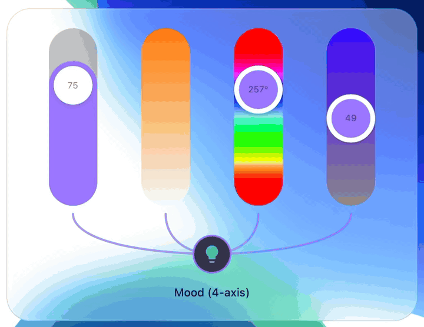
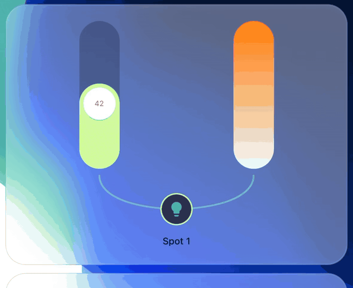
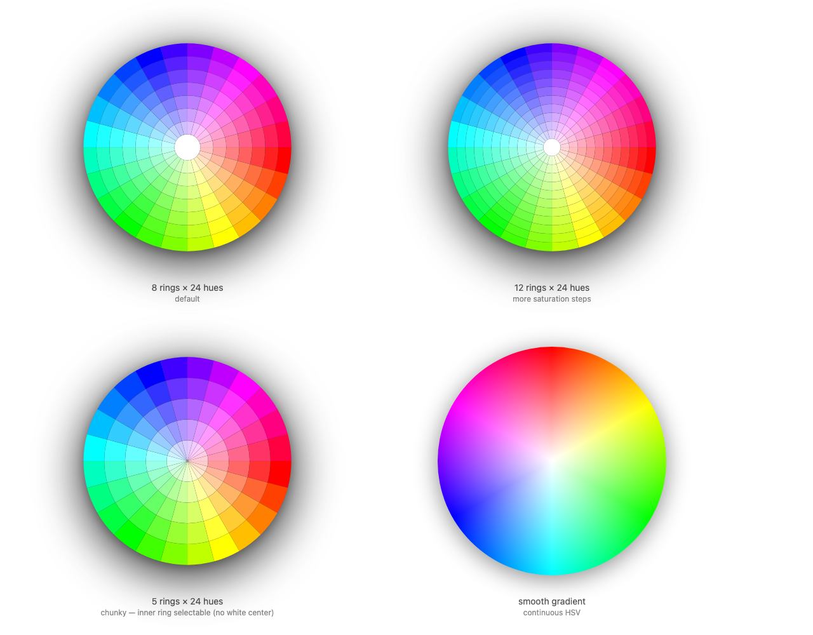
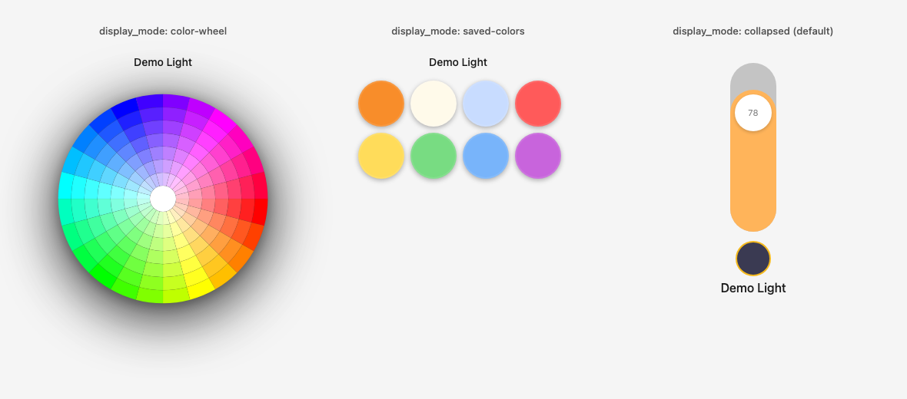
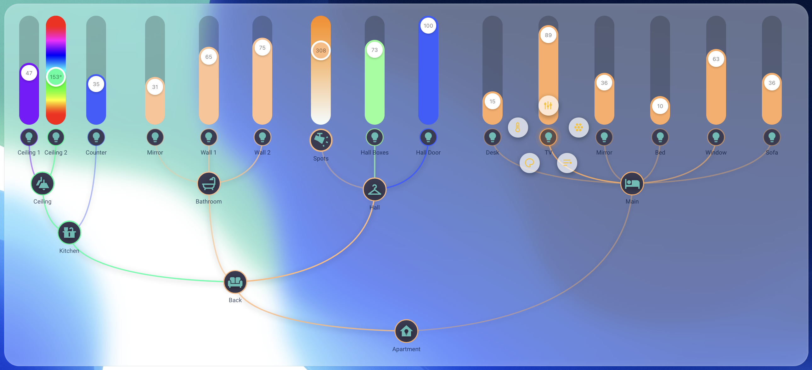

# Everyday Light Card

> A group-aware Lovelace card for Home Assistant. Mindmap topology between members and master, in-place mode picker, runtime-rotatable gestures, saved-colors edit mode.

[](https://github.com/f17mkx/everyday-light-card/releases)
[](LICENSE)
[](https://www.home-assistant.io/)
[](https://github.com/sponsors/f17mkx)
[](https://www.buymeacoffee.com/f17mkx)



## Why this exists

Home Assistant's stock light card and Mushroom give you one slider per light. Works fine for one bulb. Falls apart when you've got a group of 4-8 ceiling spots that should behave as one (and where you occasionally want to control the individual lights too). Also no clean way to see at a glance which members are on, switch slider modes without leaving the card, or build a custom mood-color palette right from the dashboard.

## What it does

- **Group control**: show 3-8 lights side-by-side with a mindmap-path connecting them to a master node. Tap toggles the whole group AND restores each member's prior brightness / color on re-on (snapshot via `scene.create`).
- **All-axis tile**: `default_view_mode: parallel` renders brightness + temperature + hue + saturation as 4 sliders side-by-side. Walk in, eyeball the room, drag any axis. No mode-switching.
- **Press-drag-select mode picker**: long-press the icon, drag onto one of the 4-diamond picker options, release. Single gesture from idle to specific control. Color wheel blooms from the option you released on.
- **Double-tap to cycle**: double-tap the icon to cycle through the slider modes.
- **Color wheel**: stepped (8 saturation rings × 24 hues default) or smooth gradient. Configurable down to 5 rings if you want a chunky look (inner ring stays selectable instead of being a white-only blob). Click any sector, light snaps to that hue+sat.
- **Saved-colors palette**: 8-cell grid you build by long-press → save current. Persists in HA's native user-data store (zero-config) or your own `input_text` helper.
- **Dedicated picker tiles**: `default_view_mode: color-wheel` or `default_view_mode: saved-colors` turns the entire card into a standalone color picker — no slider, no icon, just the wheel or the palette. See [`docs/howto/05-gradient-mood.md`](docs/howto/05-gradient-mood.md).
- **Compact-then-expand**: single tile with mindmap-arm hint. Long-press to expand inline (sibling cards reflow) or as a popup.
- **Runtime gesture rebinding**: map any tap / long-press / press-drag to any mode via config (`gestures.member_icon`, `gestures.group_icon`).
- **Theme-friendly**: consumes HA token vars (`--paper-item-icon-active-color`, `--state-light-active-color`, `--card-background-color`). Custom theme overrides via `--everyday-*` CSS variables.

### Popup wheel and double-tap mode cycle



### Color wheel variants



Configure via `color_wheel: { type: stepped, hue_segments: N, saturation_rings: M }` or `color_wheel: { type: smooth }`. When `saturation_rings: 5` or fewer, the white-center disc is automatically suppressed so the innermost ring remains a selectable low-saturation color.

### Dedicated color picker tiles



Set `default_view_mode: color-wheel` or `default_view_mode: saved-colors` to make the entire card a picker. No slider, no icon. Tap a color, light goes to that color. Recipe: [`docs/howto/05-gradient-mood.md`](docs/howto/05-gradient-mood.md).

### Apartment topology, expanded



### Collapsed group to expanded with color-mode popup


## Install (via HACS)

The card is in HACS-Default.

1. Open HACS → Frontend → Custom repositories (⋮ menu) → add `https://github.com/f17mkx/everyday-light-card` as type `Lovelace`. Skip this if the card is already listed.
2. Search "Everyday Light Card" → install.
3. Hard-refresh (Cmd/Ctrl+Shift+R).
4. Add the card to a dashboard.

## Install (manual)

1. Download `everyday-light-card.js` from the [latest release](https://github.com/f17mkx/everyday-light-card/releases/latest).
2. Copy to `<config>/www/everyday-light-card.js`.
3. Settings → Dashboards → Resources → Add: URL `/local/everyday-light-card.js`, type `JavaScript module`.
4. Hard-refresh. Add the card in dashboard edit-mode.

Full install guide: [`docs/INSTALLATION.md`](docs/INSTALLATION.md).

## Quick start

A single light:

```yaml
type: custom:everyday-light-card
entity: light.bedside_lamp
```

A compact group (single tile, long-press expands):

```yaml
type: custom:everyday-light-card
entity: light.hall_spots
group:
  layout: compact
```

A "cozy tile" with brightness + temp + hue + sat all parallel:

```yaml
type: custom:everyday-light-card
entity: light.bedroom_main
default_view_mode: parallel
parallel_sliders:
  modes: [brightness, temperature, hue, saturation]
```

A nested apartment tree:

```yaml
type: custom:everyday-light-card
entity: light.everyday_all
manual_members:
  - light.kitchen_group
  - light.bathroom_group
  - entity: light.hall_group
    manual_members:
      - light.hall_boxes
      - light.hall_door
      - light.hall_spots
  - entity: light.main_group
    manual_members:
      - light.bed_desk
      - light.bed_tv
      - light.bed_mirror
      - light.bed_lamp
      - light.bed_window
      - light.sofa
```

More recipes in [`docs/howto/`](docs/howto/).

## Documentation

- [`docs/INSTALLATION.md`](docs/INSTALLATION.md): HACS + manual install.
- [`docs/wiki/`](docs/wiki/): per-feature reference (quick-start, config schema, gestures, group-layout, color-wheel, saved-colors).
- [`docs/howto/`](docs/howto/): apartment-scenario recipes.
- [`docs/adr/`](docs/adr/): architecture decisions (popup-portal pattern, gesture detector, mindmap SVG).

## Support the work

This card is free, MIT, and built by one person on the side. If it saved you an evening of CSS-wrestling, the easiest way to say thanks:

[](https://www.buymeacoffee.com/f17mkx) &nbsp; [](https://github.com/sponsors/f17mkx)

Every tip funds the next card in the family: `everyday-shutter-card`, `everyday-climate-card`, `everyday-media-card`, `everyday-themes`.

## Roadmap

Shipped: this card (v1.0.0).

Next (rough order):

- **everyday-themes**: a coordinated theme pack for the everyday-card family with dark + light variants and the brand-token CSS vars all cards consume.
- **everyday-shutter-card**: animated shutter / cover control with tilt and dark-mode theming.
- **everyday-climate-card**: thermostat + zone-occupancy + comfort-range.
- **everyday-media-card**: media-player control with cross-room sync.
- **everyday-* dashboard pack**: a curated Lovelace strategy that uses all of them together.

Follow [@f17mkx on GitHub](https://github.com/f17mkx) for releases.

## Contributing

Bug reports, feature requests, PRs welcome. See [`docs/CONTRIBUTING.md`](docs/CONTRIBUTING.md).

## License

MIT, see [LICENSE](LICENSE).
